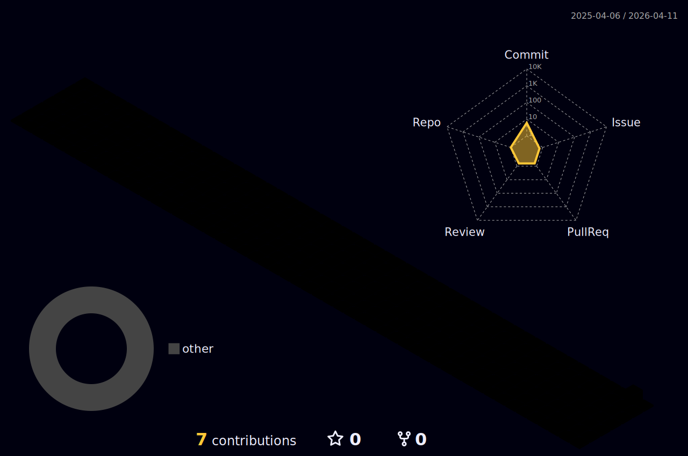

<div align="center">

```text
[ _EeZ ]
> hacker mode: enabled
> future vision: active
```

[](https://git.io/typing-svg)


</div>

<div align="center">
  
</div>

<div align="center">
  <picture>
    <source media="(prefers-color-scheme: dark)" srcset="https://raw.githubusercontent.com/_EeZ/_EeZ/output/github-contribution-grid-snake-dark.svg" />
    <source media="(prefers-color-scheme: light)" srcset="https://raw.githubusercontent.com/_EeZ/_EeZ/output/github-contribution-grid-snake.svg" />
    
  </picture>
</div>
